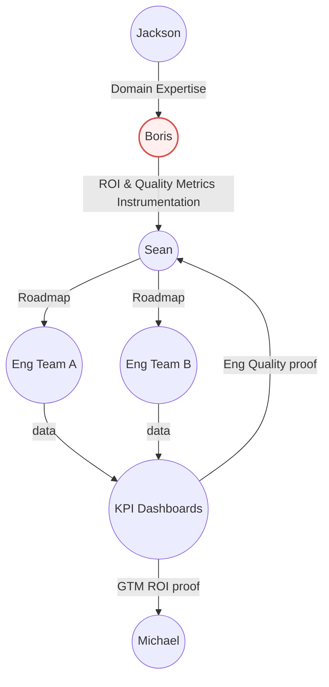

# Sindri AI — Jackson Alignment Brief

_Author: Boris Dev_  
_Audience: Jackson Giles (CPO)_  
_Date: 2025-10-17_

---

## TL;DR — Objective: Alignment

This conversation is about getting **practical alignment** between Product (Jackson), Tech (Sean + Boris), and GTM (Michael) — so we can build fast, measure impact, and scale.

-   **Role clarity:** how my work on ROI and AI quality evaluation fits into Sean's technical roadmap.
-   **Metrics:** identify 2–3 high-signal ROI metrics we can baseline now to show investor and customer value later.
-   **Quality:** define smell tests to measure AI vs competitors.
-   **Stack:** clarify SAP / CDF integration points for early instrumentation.

## 1. Role

My role in this relationship is to **absorb Jackson's domain knowledge** and turn it into **measurable ROI and AI quality metrics** that Sean can operationalize in the technical roadmap to scale out how we build, and hand over ROI success metrics to Michael for GTM right after deployment.

## 3. ROI Metrics

### Anchor Questions

> "What's the best ROI metric?"
> "Can we start making a baseline now?"

### Core ROI Levers to Probe

-   **Time to Close** — How long does it currently take to resolve NCRs of different types?
-   **Cost Recovery** — Where are dollars lost or recovered today? How visible is that data?
-   **Critical Path Impact** — Which NCR types actually delay project work vs. just create noise?
-   **SLA Compliance** — What's considered "good" resolution performance internally?
-   **Triage & Routing Accuracy** — How much manual triage effort is currently involved?

### Key Questions for Jackson

-   Which **2–3 metrics**, if improved, would **make investors or customers take notice**?
-   Can we **access historical SAP QM/MM data** now to baseline these metrics?
-   How does Aker currently **track cost leakage or delay impact**?
-   What **multipliers or heuristics** (e.g., critical path weight) already exist in the field?
-   How soon after launch should we **see and report** these metrics to Michael for GTM impact?
-   Which **NCR types** are the "low-hanging fruit" with high ROI potential?

## 3. AI Quality Evaluation

**Goal:** Align with Jackson on how to define and measure **"better product"** when comparing Sindri to an imagined competitor.

### Anchor Question

> "Imagine you have two products in front of you — ours and a competitor's.  
> What quick **smell tests** would you run to decide which one is actually better?"
