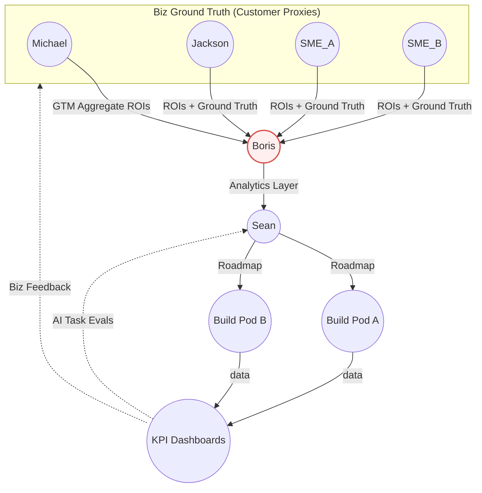

# Sindri AI — Michael Alignment Brief

_Author: Boris Dev_  
_Audience: Michael A. Rodey (CEO)_  
_Date: 2025-10-20_

---

## TL;DR — Objectives:

1. Alignment on role and my value added
2. Alignment on product vision

## 1. Role

## 2. Product Vision

### Market Position

**Special Sauce (Relevance):** Sindri has a process to build on-prem embeddable MoC (Management of Change) software in a bespoke manner _and_ scaleable manner.
In other words, our innovation is that we can combine the bespokeness of consultant integrators with the scale of SaaS tech vendors.

**Moat (Credibility):** Sindri has ROI metrics dashboards to build customer lock-in.

### Market Gap Analysis

| Player Type                                                | Why They Don't Build Sindri                                                                            |
| ---------------------------------------------------------- | ------------------------------------------------------------------------------------------------------ |
| **System Integrators** (Accenture, TCS, Worley, Wood, CGI) | Services revenue model conflicts with product licensing; productization reduces billable hours         |
| **SaaS MoC Vendors**                                       | Multi-tenant model breaks with on-prem; high support costs; can't meet oil & gas security requirements |

### Riskiest Assumptions

| Risk Category                   | Controlled               | Risk                       | Mitigation                                 |
| ------------------------------- | ------------------------ | -------------------------- | ------------------------------------------ |
| **Scaling Bespoke Deployments** | 70-80% component reuse   | Customization creep to 50% | Sean and Jackson's architecture discipline |
| **SaaS Competition**            | On-prem moat             | ?                          | Sean and Jackon's user, data-centric AI    |
| **Deployment Speed**            | Repeatable templates/SDK | Enterprise approval cycles | Align with trusted **integrators**         |
| **Sales Velocity**              | Land-and-expand model    | Enterprise approval cycles | Align with trusted **integrators**         |

### Boris's Questions

-   Where is my mental model off?
-   Who will acquire us?
-   Should we build for integrators or customer IT departments?
-   What's the top aggregate ROI target for customer CEOs/investors to see?
-   Who are our competitors?
