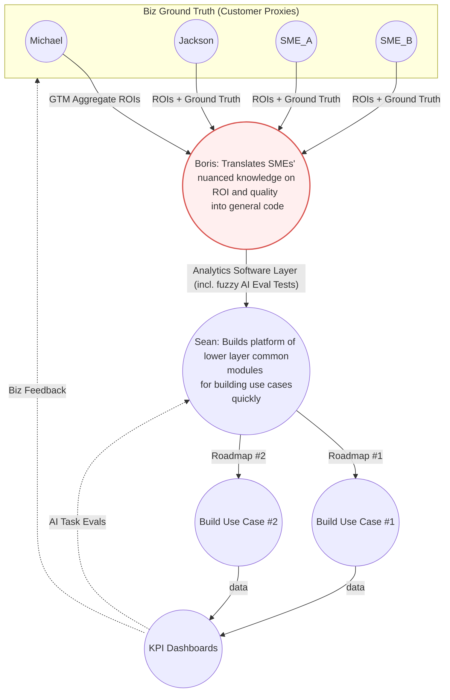

# Sindri AI — Michael-Boris Alignment Brief

_Author: Boris Dev_  
_Audience: Michael A. Rodey (CEO)_  
_Date: 2025-10-20_

---

## TL;DR — Objective: Alignment

1. My role and my value added
2. Alignment on product vision

## 1. Role

## 2. Boris's Product Vision Alignment Questions

Where am I off the mark?

### What is Sindri all about?

Sindri builds EPC document management software for billion dollar plus projects that cuts down 10% of project waste and cuts toil for field engineers.

</dl>

### What is the gap being filled?

Sindri's product fills a gap between system integrators (ie., Accenture) making piecemeal bespoke on-prem IMS embedded applications and SaaS Vendors making off-the-shelf products that are scalable but hard to personalize for each customer (ie., poor user experience quality for the field engineers).

### What's the new timing situation and our riskiest assumption?

The recent emergence of language AI tech might allow this gap above to be filled for the first time by a new type of software that leverages natural language AI interfaces to give the customers a bespoke feel while giving the Sindri business a scalable system. This "new" tech is the riskiest assumption. It's a hard product-sales-tech balance problem to keep the complexity-cost low while expanding use cases and expanding customer customizations to keep growth high.

### What is our unfair advantage?

The faster a startup in this field builds ROI credibility the faster they build a moat of customer lock-in and upselling that must be balanced against the con of moving too fast and risking tech debt complexity that stalls tech innovation. Therefore the question is, what makes Sindri faster and more balanced than other SaaS vendors in exploiting the new language AI tech to build this new type of software. The unfair advantage of Sindri is the mix of expertise and creative collective ethos of the team.

More concretely, the Sindri team can quickly translate user problems into a high ROI quality product faster than others because three types of knowledge collide with their founders:

1. user field experience ground truth knowledge
2. tech experience building multi-tenant data platforms for heavy industry clients,
3. business leadership experience in the oil data industry.

---

### Boris's Curiosity Questions

1. Why wouldn't a billion dollar company just make their own internal NCR app?
2. What's the top aggregate ROI EPC metric CEOs and investors will want us to show them?
3. What are your thoughts on balancing customer snowflake/bespoke features with reduced tech complexity for innovation (nimbleness)?
4. Top 2 that may acquire us?
5. Top 2 competitors?
6. Top 2 systems integrators that may partner with us?
7. How do you like to get complex information?

-   zoom discussion
-   slack discussions
-   amazon 6-pagers (read white paper then Q&A meeting)
-   short white papers
-   demos
-   diagrams
-   etc...

8. What are your pain points?

-   do you need a quick demo process?
-   do you need a KPI dashboard prototype?
