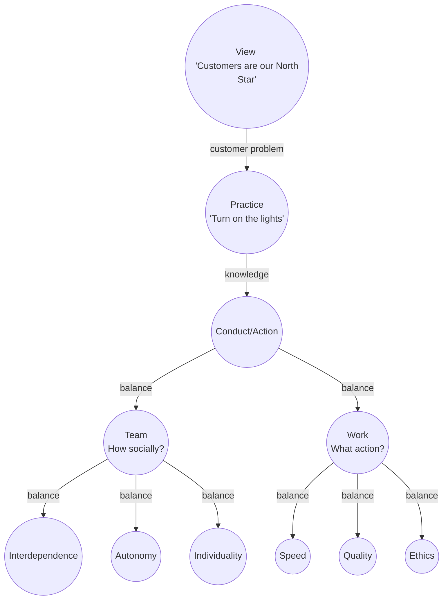

# Zillow in a nutshell

## References

- [story](https://www.zillowgroup.com/about-us/story)
- [values](https://www.zillow.com/careers/our-values/)

## Distilling Zillow's 8 Core Values into three parts

1. The View - Purpose - customer
2. The Practice - have an open state of mind - put on the light - use all information
3. The Conduct - two balancing trilemmas
  a. balance - trilemna - speed, quality, ethics
  b. balance - autonomy, interdependence, individuality 
  

## Two phase history of product

Customer journey starts with the Home search and ends with closing.

- Phase 1:  Zestimate real estate prediction valuation service. 
- Phase 2 (now):  real estate transaction service

## Zillow's eight values mapped to my mental model

### Basic truths

- [ ] Customers Are Our North Star - Avoid XY problem, question ROI on the customer
- [ ] Turn On the Lights - Information to Avoid waste. XY problem, think big picture

### Balance speed and quality and whats right -- tri-lemma

- [ ] Think Big, Move Fast -- choose low-hanging business fruit 
- [ ] Do the Right Thing - ethics
- [ ] Deliver Quality on Time, Every Time -- balance speed and quality for customer 

### Balance of individualism and team work

- [x] Include and Empower - fairness, diversity, individualism, no tyranny of the masses
- [x] Better Together -- Interdependence, Team work
- [ ] Own It - autonomy and accountability

## Behaviors We Expect from Our Leaders

"We know that empathetic and effective leadership is critical to creating and maintaining a world-class work culture"

- [ ] Build Relationships Based on Trust, Transparency and Shared Success.
- [ ] Foster an Environment Where All Can Thrive, Today and Tomorrow.
- [ ] Act Decisively and Strategically.
- [ ] Create Clarity from Ambiguity.
- [ ] Expect the Best from Self and Others.

# Distilling interview with Jonathon

## Applied data scientist build the prediction services ingested by product engineering

## Data scientists bespoke forecasting, analysis, and EDA for business decisions

- tools: Snowflake and Looker, pre-canned SQL queries into models that make metrics....organize this

## Continuous improvement on Business goals

- high conversion rates
- predict high propensity to close contacts
- use customer behavior on site to predict propensity to close
- track follow-up of agent
- observability of customer experience on the site

## Depends on automation of analytics team processes

## How analytics team fits into bigger picture of continuous improvement

- Growth ie. Growth hacking experiments
- Data driven product development, What's the next thing to make, What the smallest next intervention
- depends on forming a collective causal mental model, iteratively  
- depends on observability or measurements to analyze, reports
- depends on instrumentation
- depends on domain modeling -- mental models of stakeholders
  - what are product analysts looking for?
  - what are business analysts looking for?

## Boris's ideas on implementation details

- [Setting up dbt, Connecting to Snowflake, and Creating Your First dbt Model](https://medium.com/learning-sql/setting-up-dbt-connecting-to-snowflake-and-creating-your-first-dbt-model-c0d5691b4200)
- MLFLow, Weights and Biases app: log changes, log rationales, log experimental results
- version control analytics code, datasets, reproducibility
